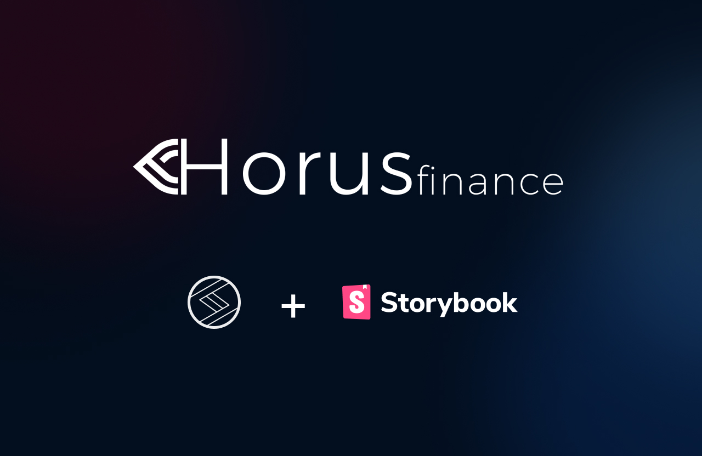

# Horus UI - Horus Finance Design System

## An entire design system built in 24 hours to win a Hackathon.

**Horus-UI core**

Framework-agnostic implementation.

```
yarn add @horus-finance/tokens
```
or
```
npm install @horus-finance/tokens
```

**Horus-UI React**

Primitive components built with [Stitches](https://stitches.dev/).

```
yarn add @horus-finance/react
```
or
```
npm install @horus-finance/react
```

## Documentation

For full documentation, visit the [homepage](https://davialc.github.io/horus-ui/)

## Author

- [Davi Alcântara](https://www.linkedin.com/in/davialcantara/)

## License

Licensed under the [MIT License](/LICENSE.md).
